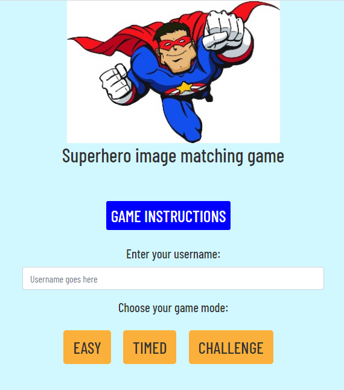
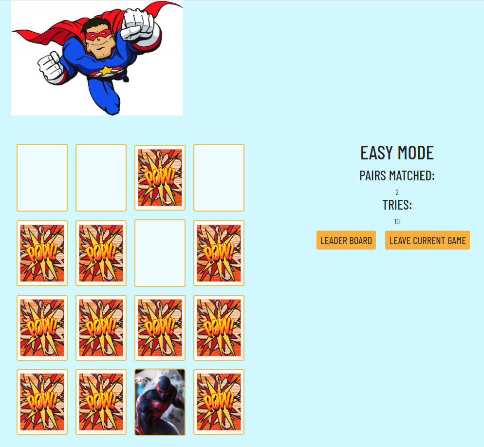

# Superhero Memory Game

This game merges a love of learning with a favorite childhood pastime. 

## Description

Game begins with the Welcome Page. Game Instructions are provided in a modal format. The player must enter their username to play. Error modal pops up if no username is entered. After the username is provided the user can choose the mode of play.

Easy, Timed, or Challenge modes are provided. Information about these modes is offered in the Game Instructions.

The user can play as much as they would like.  Each play is stored in localStorage with the username and # of tries. This information is retrieved from localStorage when the user clicks on the leader board option. Leader board is only accessible after the round of play is complete.

**APIs to be used**

- **Super Hero API** (http://superheroapi.com/) for the images on the cards.

## Link to Site

https://codragon2020.github.io/hero_memory_game/

**This site was made with:**

## Screenshots

